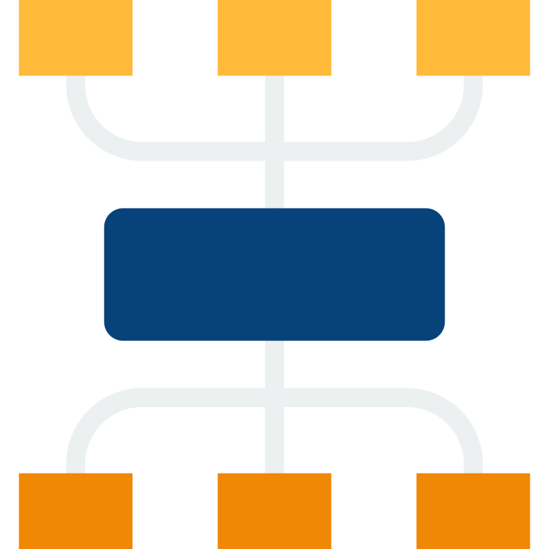

# Catalyst



## Overview

Catalyst is a software tool designed to facilitate the conversion of
C4 diagrams written in [PlantUML](https://plantuml.com/) format into [draw.io](https://draw.io)
C4 diagrams. While PlantUML itself is not required as a runtime dependency, 
the tool parses diagrams written in PlantUML's C4 syntax (.puml files). 
This project uses the Dagre layout engine for fast, pure JavaScript
layout calculation without external dependencies.

## Requirements

The following dependencies needs to be available on the system:

- [NodeJS](https://nodejs.org)

## Input Format

Catalyst processes C4 diagrams written in PlantUML syntax (.puml files). While the PlantUML 
runtime is not required, the input files should follow PlantUML's C4 diagram syntax including:

- `System()`, `Container()`, `Component()` declarations
- `Rel()` relationship definitions  
- Standard PlantUML C4 includes and formatting

Example input file structure:
```plantuml
@startuml
!include https://raw.githubusercontent.com/plantuml-stdlib/C4-PlantUML/master/C4_Container.puml

System(systemA, "System A", "Description")
Container(containerA, "Container A", "Technology", "Description")
Component(componentA, "Component A", "Technology", "Description")

Rel(systemA, containerA, "Uses")
@enduml
```

## Try it out

- Checkout this repo
- Run `npm install` to install dependencies
- Run `npm run dev` to start typescript compiler
- Run `npm run exec` to test catalyst with Dagre layout engine

The output is written to `output.drawio`.

### Usage Options

**Basic Usage**
```bash
npm run exec
```

**Custom Usage**
```bash
# With custom files
node ./dist/src/catalyst.mjs -i input.puml -o output.drawio

# With custom layout direction
node ./dist/src/catalyst.mjs -i input.puml -o output.drawio --layout-direction LR
```

You may try to make changes to `diagram.puml` (PlantUML C4 format) to see how catalyst behaves with the Dagre layout engine.

## Purpose

### Bridging Standards

PlantUML C4 format and draw.io are widely used diagramming approaches, each with unique
strengths. While PlantUML C4 format excels in creating architectural diagrams using textual
descriptions, draw.io offers a more visual and intuitive diagramming
experience. This project seeks to bridge the gap between these two approaches,
allowing users to harness the power of both tools without requiring PlantUML runtime.

### Supporting C4 Modelling

The primary goal of this project is to support the [C4](https://c4model.com)
modelling standard. C4 (Context, Containers, Components, and Code) is a popular
architectural modeling approach for visualizing and documenting software
architecture. By enabling the conversion of PlantUML C4 diagrams to draw.io,
this tool facilitates the adoption of C4 modelling by providing a smooth
transition from PlantUML's text-based format to draw.io's graphical capabilities.

## Key Features

- **PlantUML C4 Format Support:** The converter parses and converts C4 diagrams 
written in PlantUML syntax (.puml files) without requiring PlantUML runtime.

- **Fast Layout Engine:** Uses Dagre for pure JavaScript layout calculation,
eliminating external dependencies and providing fast performance.

- **draw.io Integration:** The resulting draw.io diagrams are seamlessly
integrated with draw.io's native features, allowing users to further enhance and
refine their diagrams.

## Getting Started

1. **Installation:** Clone the repository and follow the installation
instructions in the README file.

2. **Usage:** Refer to the documentation for detailed instructions on how to use
the converter. Examples and usage scenarios are provided to assist you.

3. **Contribute:** We welcome contributions from the community. Feel free to
submit bug reports, feature requests, or pull requests on our GitHub repository.

## Why Convert?

### Flexibility and Collaboration

- **Textual vs. Visual:** PlantUML C4 format allows you to describe diagrams using text,
which can be convenient for version control and collaboration. However, draw.io
offers a more visual and interactive approach, making it easier to create
complex diagrams.

- **Team Collaboration:** Converting PlantUML diagrams to draw.io format can
enhance team collaboration. Team members can work on diagrams using the
user-friendly draw.io interface, even if they are not familiar with PlantUML.

### C4 Modelling Adoption

- **C4 Modelling:** C4 is a widely adopted standard for software architecture
modeling. By supporting C4 modelling in draw.io, this converter facilitates the
adoption of this powerful approach.

- **Better Visualization:** draw.io's graphical capabilities enable the creation
of more visually appealing and informative C4 diagrams, enhancing the
communication of architectural concepts.

## License

This project is released under the [MIT License](LICENSE). You are free to use,
modify, and distribute the software as per the terms of the license.

## Feedback and Support

If you have any questions, feedback, or encounter issues with the converter,
please open an issue.
