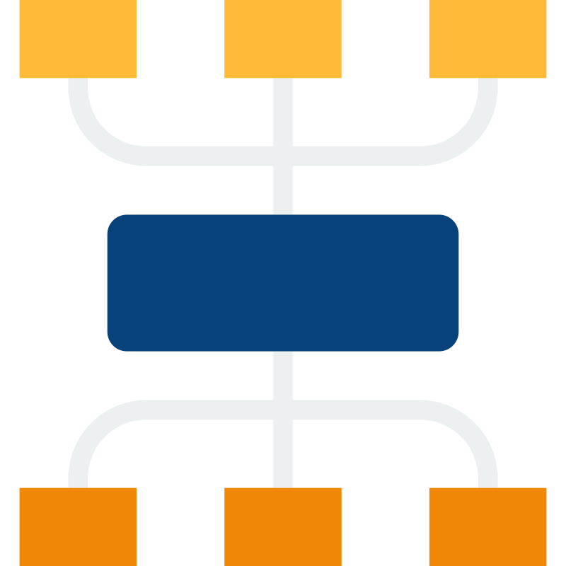
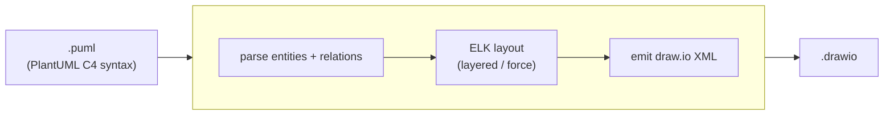

# Catalyst

<div align="center">
  
</div>

[](https://github.com/AndriyKalashnykov/catalyst/actions/workflows/ci.yml)
[](https://hits.sh/github.com/AndriyKalashnykov/catalyst/)
[](LICENSE)

JavaScript/TypeScript library that converts C4 diagrams written in PlantUML
C4 syntax (`.puml`) into [draw.io](https://draw.io) XML — no PlantUML runtime
required. The **consumer surface** is a one-call API
(`Catalyst.convert(puml, options)`) plus `parseEntities` / `parseRelations`,
installed as a git dependency. The **engine surface** uses
[elkjs](https://github.com/kieler/elkjs) (Eclipse Layout Kernel) with
spec-driven algorithm selection — `layered` for hierarchical C4
(Container/Component/Deployment), `force` for hub-and-spoke Context — real
font-metric node sizing, and structural-parity + golden-snapshot +
layout-quality test gates.

> **Project status:** independently maintained. Originated as a fork of
> [localgod/catalyst](https://github.com/localgod/catalyst) (MIT) but has
> substantially diverged — the layout engine was replaced (dagre → elkjs),
> with real font-metric sizing, spec-driven algorithm selection, and
> structural parity/snapshot/layout-quality gates. It does **not** track
> upstream (which is inactive); upstream attribution is retained in
> [LICENSE](LICENSE). Not published to npm — consumed as a git dependency.


```mermaid
flowchart LR
  P[".puml<br/>(PlantUML C4 syntax)"] --> A["Catalyst.convert()"]
  subgraph A[" "]
    direction LR
    PR[parse entities + relations] --> EL["ELK layout<br/>(layered / force)"] --> MX[emit draw.io XML]
  end
  A --> D[".drawio"]
```

## Tech Stack

| Component | Technology |
|-----------|-----------|
| Language | TypeScript 5.8, ES2024 (`.mts` ESM) |
| Runtime | Node.js (ES2024+) |
| Layout engine | elkjs (Eclipse Layout Kernel) — `layered` + `force` |
| Text metrics | fontkit + bundled Liberation Sans (SIL OFL) |
| Serialization | xml2js |
| Tests | Vitest — unit, structural parity, golden snapshot, layout quality, corpus sanity |
| Lint | oxlint + markdownlint (pinned `markdownlint-cli` devDependency) |
| Visual proof | PlantUML jar + `rlespinasse/drawio-export` (via `make render-compare` / `make gallery`) |

## Quick Start

This library is consumed as a **git dependency** (it is not on the npm
registry). Pin a tag:

```bash
# add to a project (npm resolves it under the package name "catalyst")
npm install github:AndriyKalashnykov/catalyst#v1.4.0

# development of catalyst itself
make deps      # npm ci
make build     # compile TypeScript -> dist/
make test      # full vitest suite (unit + parity + golden + layout-quality)
```

## Prerequisites

| Tool | Version | Purpose |
|------|---------|---------|
| [Node.js](https://nodejs.org/) | ES2024+ | Runtime and build |
| [GNU Make](https://www.gnu.org/software/make/) | 3.81+ | Build orchestration |
| [Git](https://git-scm.com/) | latest | Dependency resolution (git install) |
| [Docker](https://www.docker.com/) | latest | `make render-compare` only (drawio-export) |
| [Java](https://adoptium.net/) | 17+ | `make render-compare` only (PlantUML render) |

```bash
make deps
```

## Usage

```javascript
import { Catalyst } from 'catalyst'
import fs from 'fs'

const puml = await fs.promises.readFile('diagram.puml', 'utf-8')
const drawioXml = await Catalyst.convert(puml)
await fs.promises.writeFile('output.drawio', drawioXml)
```

Layout options (all optional; defaults shown):

```javascript
const drawioXml = await Catalyst.convert(puml, {
  layoutDirection: 'TB',  // 'TB' | 'BT' | 'LR' | 'RL'
  nodesep: 50,            // node separation (px)
  edgesep: 10,            // edge separation (px)
  ranksep: 50,            // rank separation (px)
  marginx: 20,
  marginy: 20
})
```

Parse-only helpers:

```javascript
const entities  = Catalyst.parseEntities(puml)   // EntityDescriptor[]
const relations = Catalyst.parseRelations(puml)   // { source, target, label, ... }[]
```

Input is standard PlantUML C4 syntax — `Person()`, `System()`, `Container()`,
`Component()`, `Deployment_Node()`, boundaries, and the full `Rel`/`BiRel`/
`Lay_*` surface. Pin the C4-PlantUML include to a tagged release:

```plantuml
@startuml
!include https://raw.githubusercontent.com/plantuml-stdlib/C4-PlantUML/v2.10.0/C4_Container.puml

System(systemA, "System A", "Description")
Container(containerA, "Container A", "Technology", "Description")
Rel(systemA, containerA, "Uses")
@enduml
```

Coverage of the full C4-PlantUML surface is tracked in
[`docs/C4-COVERAGE.md`](docs/C4-COVERAGE.md).

catalyst converts the **static C4 subset only** (Context / Container /
Component / Deployment). The C4-PlantUML **dynamic/sequence** family
(`C4_Sequence.puml`, `actor`/`participant` + message arrows / `==stage==`
dividers) is **not** supported: `Catalyst.convert()` **throws** a clear
error rather than emitting a content-less stub, so callers fail fast
instead of generating blank artifacts. Likewise, any input that yields
zero entities and zero relations is rejected.

## Layout engine

elkjs is selected per the **C4 spec level** of the source (a semantic fact,
not a heuristic):

- **Container / Component / Deployment** (hierarchical) → `org.eclipse.elk.layered`
  — layered flow, orthogonal routed connectors, native compound nesting.
- **Context** (people/systems only — hub-and-spoke) → `org.eclipse.elk.force`
  — balanced placement (a Context overview is not a flow diagram; a layered
  engine, including PlantUML's own Graphviz/dot, spreads a star into a wide
  ribbon).

Node sizes are measured from the real label font (fontkit + bundled
Liberation Sans), floored at the conventional C4 element-box size so rendered
shapes never cram. Directional intent: `Rel_U/D` honored on the layered path;
`Rel_L/R` honored when nodes share a rank (cross-rank L/R is not expressible
in any layered engine).

Relationship rendering: the verb is shown bold with the technology
bracketed below it (an absent technology yields no `[]` artifact); entity
descriptions are preserved for every C4 element (including `Person`/`System`,
which have no technology parameter); `RelIndex(...)` dynamic relations are
parsed. When two or more relations connect the **same node pair**
(antiparallel `Rel`+`Rel_Back` or parallel duplicates), each is fanned onto
its own lane — a perpendicular waypoint plus an offset label — so connectors
and labels never render collinear or stacked.

## Available Make Targets

Run `make help` to list targets.

| Target | Description |
|--------|-------------|
| `make deps` | Install dependencies (`npm ci`) |
| `make build` | Compile TypeScript → `dist/` |
| `make lint` | `oxlint src/` + `markdownlint` (parity with CI's lint job) |
| `make test` | Full Vitest suite (unit + parity + golden + layout-quality + corpus sanity) |
| `make golden-update` | Regenerate draw.io structural snapshots after an intentional change |
| `make render-compare` | Visual proof: render one source `.puml` and the catalyst `.drawio` side by side (requires Java + Docker) |
| `make gallery` | Dual-render the whole use-case corpus into `docs/gallery/` (requires Java + Docker) |
| `make ci` | Local CI pipeline — build + lint (oxlint + markdownlint) + test |

## CI/CD

GitHub Actions (`🔨CI`, `.github/workflows/ci.yml`) runs on every push,
pull request, and `workflow_dispatch`:

| Job | Steps |
|-----|-------|
| **lint** | `oxlint` + `markdownlint` |
| **test** | Full Vitest suite with coverage (85% thresholds) |

No repository secrets or variables are required (`GITHUB_TOKEN` only).
Releases are **git tags only** (`vX.Y.Z`) — no formal GitHub Releases;
downstream consumers track tags via the `github-tags` datasource. The
package is git-consumed, not npm-published.

## Verifying conversions (parity, snapshots, visual proof)

PlantUML and draw.io use different layout engines, so a rendered `.puml` and
the converted `.drawio` are **never pixel-identical** even for a perfect
conversion. Correctness is therefore guaranteed structurally, not visually:

- **Structural parity** (`tests/parity.test.mts`) — for every fixture
  (including `tests/fixtures/c4-exhaustive.puml`, which exercises every
  C4-PlantUML primitive in [`docs/C4-COVERAGE.md`](docs/C4-COVERAGE.md)):
  every parsed entity emits a draw.io shape with a matching `c4Type`, every
  relation emits one connector (parallel relations and self-loops included),
  every connector endpoint resolves to an emitted shape, and a
  `<diagram id+name>` is present. Loss fails the build.
- **Drawio structural snapshot** (`tests/golden.test.mjs`) — a deterministic,
  same-engine regression gate (committed fingerprints under `tests/golden/`).
  Regenerate intentional changes with `make golden-update`.
- **Layout quality** (`tests/layout-quality.test.mts`) — every leaf shape is
  at least the conventional C4 element-box size for its type and no two leaf
  shapes overlap, so the rendered diagram does not cram. Catches under-sizing
  the structural gates (coordinate-independent by design) cannot.
- **Corpus sanity gate** (`tests/corpus-sanity.test.mts`) — for every fixture
  in [`tests/fixtures/corpus/`](tests/fixtures/corpus/) (topology shapes,
  relationship variants, C4 levels, edge cases): output is well-formed XML,
  no entity dropped, every relation is an edge with resolved endpoints in the
  PUML direction, the verb is non-empty, no `[]` artifact, descriptions are
  preserved, and same-node-pair edges get distinct routes. Covers the label
  text the golden fingerprint intentionally excludes.
- **Visual proof** (`make render-compare`, `make gallery`) —
  `render-compare` renders one source `.puml` and its `.drawio` side by side;
  `make gallery` dual-renders the whole corpus into
  [`docs/gallery/`](docs/gallery/) with an indexed README. Requires Java +
  Docker; **not** a CI gate.

Current: **218 tests** across unit, parity, golden-snapshot,
layout-quality, corpus-sanity and edge-lane suites; 85% coverage thresholds
enforced in CI.

## Contributing

Contributions welcome — open a PR or an issue.

## License

Released under the [MIT License](LICENSE). This project originated from
[localgod/catalyst](https://github.com/localgod/catalyst); the original
copyright and license terms are retained in [LICENSE](LICENSE). The bundled
Liberation Sans fonts (used for text measurement) are under the SIL Open
Font License 1.1 — see [src/assets/fonts/LICENSE](src/assets/fonts/LICENSE).
