# Conversion gallery — use-case corpus

Generated by `make gallery` (`scripts/gallery.mjs`) from every fixture in
[`tests/fixtures/corpus/`](../../tests/fixtures/corpus/). Each row shows the
**source PlantUML** render next to the **catalyst → draw.io** render.

> PlantUML and draw.io use different layout engines — the two images are
> never pixel-identical. Compare **content**: every box, arrow, verb,
> technology `[in brackets]`, and description must survive. The machine
> gate is [`tests/corpus-sanity.test.mts`](../../tests/corpus-sanity.test.mts).

Regenerate after any engine change: `make gallery && git add docs/gallery/`.

## Topology shapes

Stresses the ELK layout engine: rank ordering, fan-out, wide ranks, cycles, disconnected components, deep nesting.

### `topology-cyclic.puml`

| Source PlantUML | catalyst → draw.io |
|---|---|
| 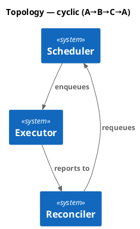 | 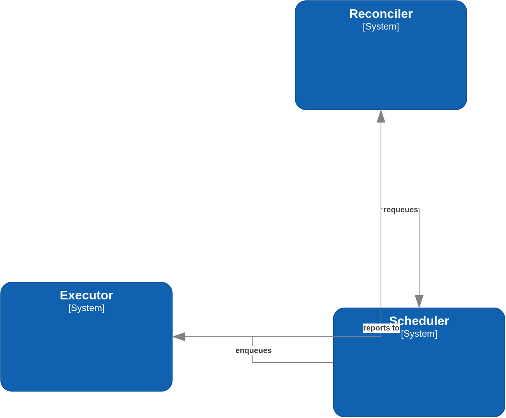 |

PlantUML source

```plantuml
@startuml topology-cyclic
!include https://raw.githubusercontent.com/plantuml-stdlib/C4-PlantUML/v2.10.0/C4_Context.puml
title Topology — cyclic (A→B→C→A)
System(a, "Scheduler")
System(b, "Executor")
System(c, "Reconciler")
Rel(a, b, "enqueues")
Rel(b, c, "reports to")
Rel(c, a, "requeues")
@enduml
```

### `topology-deep-nesting.puml`

| Source PlantUML | catalyst → draw.io |
|---|---|
| 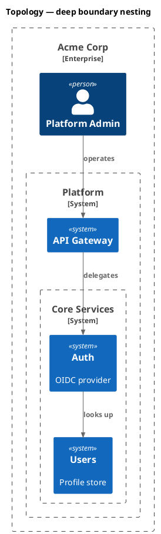 | 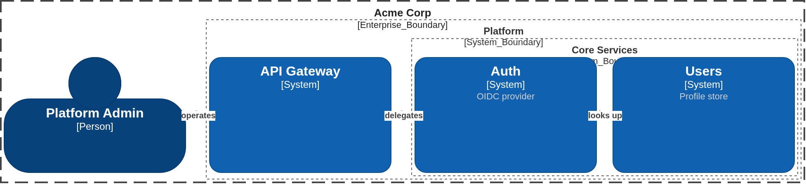 |

PlantUML source

```plantuml
@startuml topology-deep-nesting
!include https://raw.githubusercontent.com/plantuml-stdlib/C4-PlantUML/v2.10.0/C4_Context.puml
title Topology — deep boundary nesting
Enterprise_Boundary(ent, "Acme Corp") {
  System_Boundary(plat, "Platform") {
    System_Boundary(core, "Core Services") {
      System(auth, "Auth", "OIDC provider")
      System(usr, "Users", "Profile store")
    }
    System(gw, "API Gateway")
  }
  Person(admin, "Platform Admin")
}
Rel(admin, gw, "operates")
Rel(gw, auth, "delegates")
Rel(auth, usr, "looks up")
@enduml
```

### `topology-disconnected.puml`

| Source PlantUML | catalyst → draw.io |
|---|---|
| 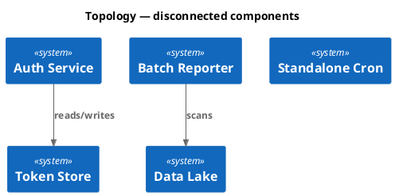 | 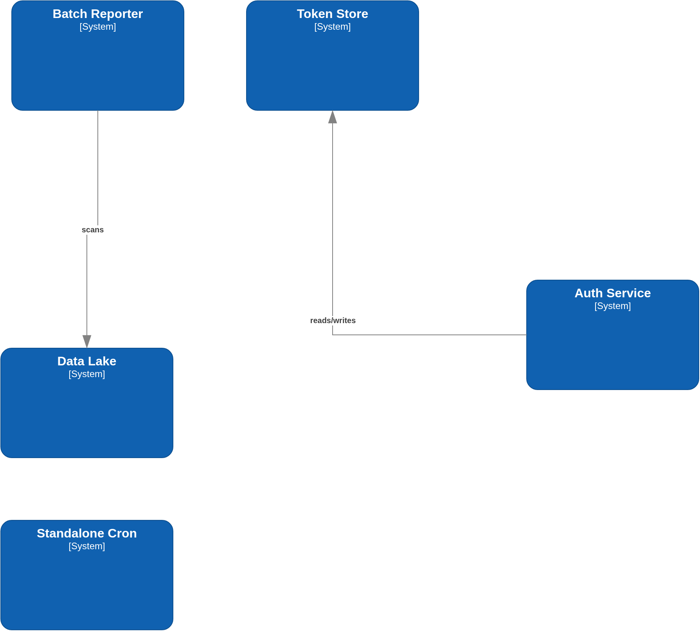 |

PlantUML source

```plantuml
@startuml topology-disconnected
!include https://raw.githubusercontent.com/plantuml-stdlib/C4-PlantUML/v2.10.0/C4_Context.puml
title Topology — disconnected components
System(a1, "Auth Service")
System(a2, "Token Store")
Rel(a1, a2, "reads/writes")
System(b1, "Batch Reporter")
System(b2, "Data Lake")
Rel(b1, b2, "scans")
System(lonely, "Standalone Cron")
@enduml
```

### `topology-hub-spoke.puml`

| Source PlantUML | catalyst → draw.io |
|---|---|
| 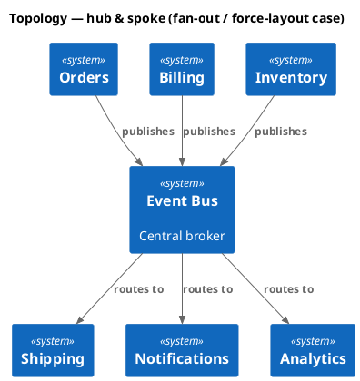 | 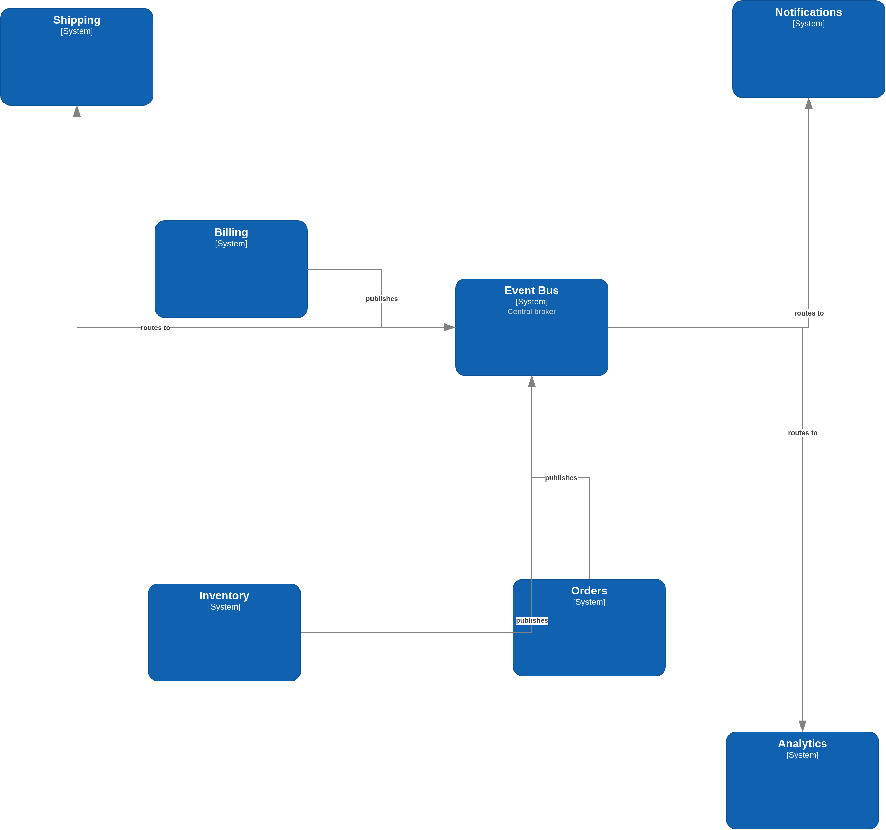 |

PlantUML source

```plantuml
@startuml topology-hub-spoke
!include https://raw.githubusercontent.com/plantuml-stdlib/C4-PlantUML/v2.10.0/C4_Context.puml
title Topology — hub & spoke (fan-out / force-layout case)
System(hub, "Event Bus", "Central broker")
System(s1, "Orders")
System(s2, "Billing")
System(s3, "Inventory")
System(s4, "Shipping")
System(s5, "Notifications")
System(s6, "Analytics")
Rel(s1, hub, "publishes")
Rel(s2, hub, "publishes")
Rel(s3, hub, "publishes")
Rel(hub, s4, "routes to")
Rel(hub, s5, "routes to")
Rel(hub, s6, "routes to")
@enduml
```

### `topology-linear-chain.puml`

| Source PlantUML | catalyst → draw.io |
|---|---|
| 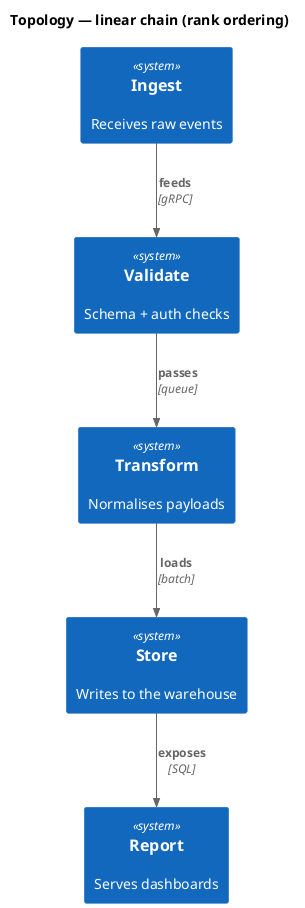 | 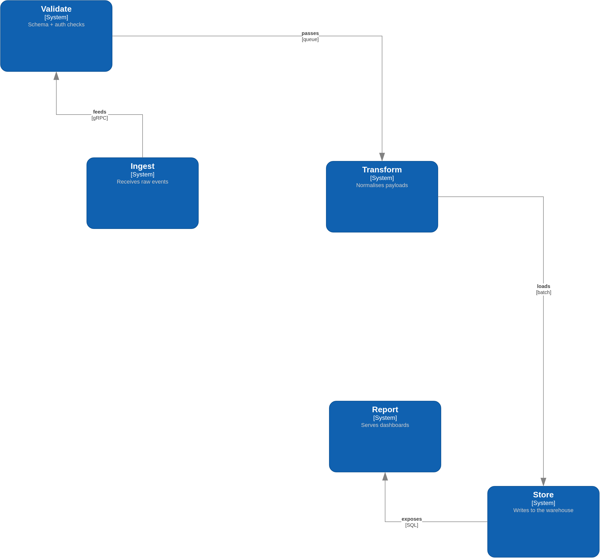 |

PlantUML source

```plantuml
@startuml topology-linear-chain
!include https://raw.githubusercontent.com/plantuml-stdlib/C4-PlantUML/v2.10.0/C4_Context.puml
title Topology — linear chain (rank ordering)
System(a, "Ingest", "Receives raw events")
System(b, "Validate", "Schema + auth checks")
System(c, "Transform", "Normalises payloads")
System(d, "Store", "Writes to the warehouse")
System(e, "Report", "Serves dashboards")
Rel(a, b, "feeds", "gRPC")
Rel(b, c, "passes", "queue")
Rel(c, d, "loads", "batch")
Rel(d, e, "exposes", "SQL")
@enduml
```

### `topology-wide-rank.puml`

| Source PlantUML | catalyst → draw.io |
|---|---|
| 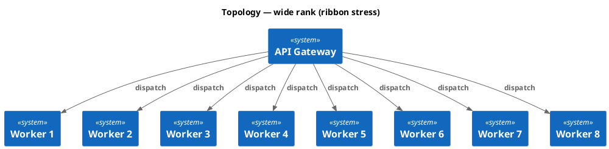 | 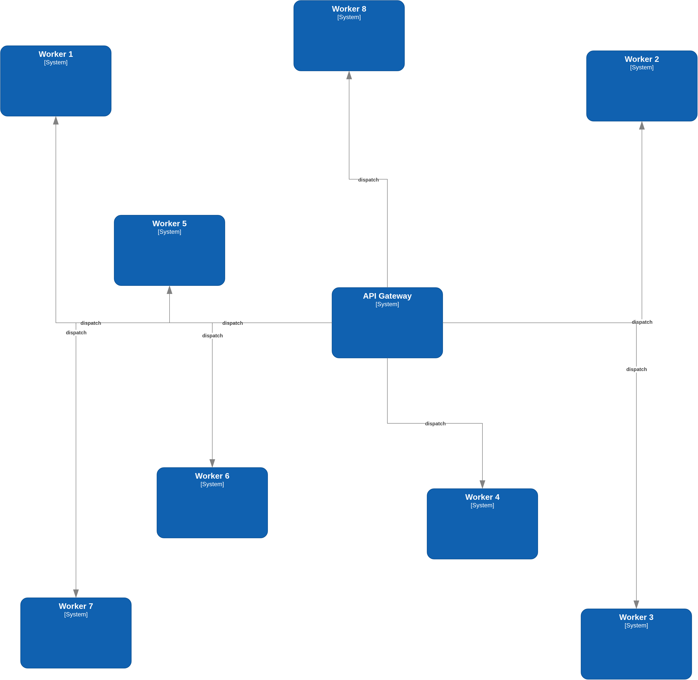 |

PlantUML source

```plantuml
@startuml topology-wide-rank
!include https://raw.githubusercontent.com/plantuml-stdlib/C4-PlantUML/v2.10.0/C4_Context.puml
title Topology — wide rank (ribbon stress)
System(src, "API Gateway")
System(w1, "Worker 1")
System(w2, "Worker 2")
System(w3, "Worker 3")
System(w4, "Worker 4")
System(w5, "Worker 5")
System(w6, "Worker 6")
System(w7, "Worker 7")
System(w8, "Worker 8")
Rel(src, w1, "dispatch")
Rel(src, w2, "dispatch")
Rel(src, w3, "dispatch")
Rel(src, w4, "dispatch")
Rel(src, w5, "dispatch")
Rel(src, w6, "dispatch")
Rel(src, w7, "dispatch")
Rel(src, w8, "dispatch")
@enduml
```

## Relationship variants

Bidirectional, directional hints, with/without technology, long labels, layout-only `Lay_` constraints.

### `rel-bidirectional.puml`

| Source PlantUML | catalyst → draw.io |
|---|---|
| 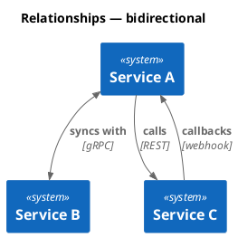 | 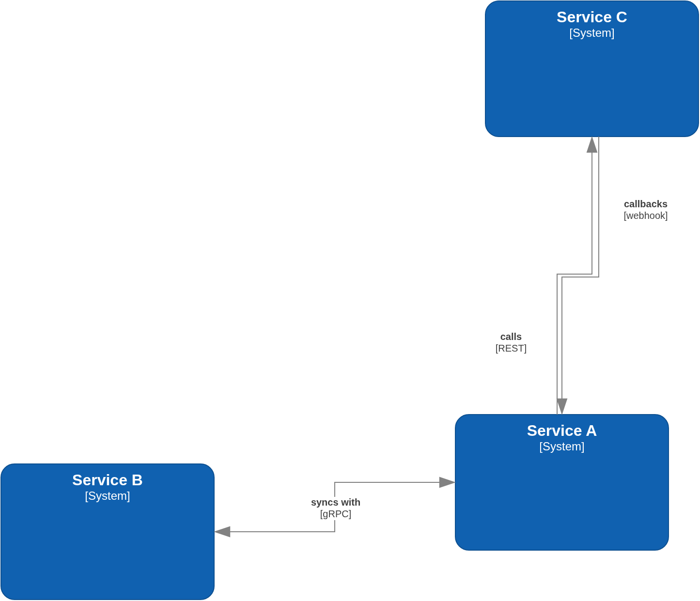 |

PlantUML source

```plantuml
@startuml rel-bidirectional
!include https://raw.githubusercontent.com/plantuml-stdlib/C4-PlantUML/v2.10.0/C4_Container.puml
title Relationships — bidirectional
System(a, "Service A")
System(b, "Service B")
System(c, "Service C")
BiRel(a, b, "syncs with", "gRPC")
Rel(a, c, "calls", "REST")
Rel(c, a, "callbacks", "webhook")
@enduml
```

### `rel-directional.puml`

| Source PlantUML | catalyst → draw.io |
|---|---|
| 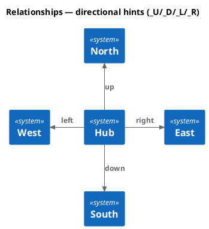 | 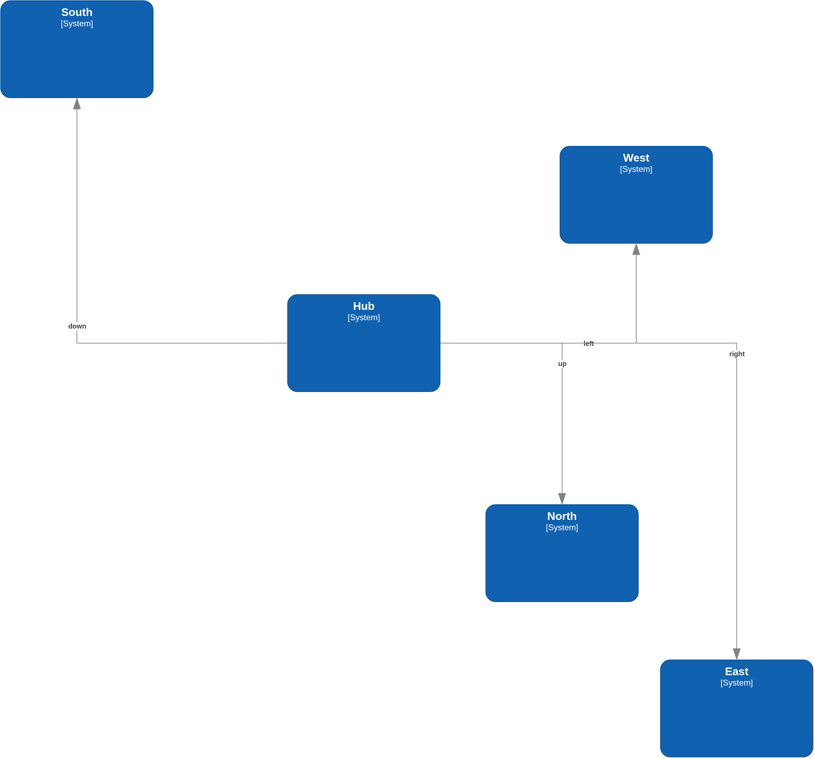 |

PlantUML source

```plantuml
@startuml rel-directional
!include https://raw.githubusercontent.com/plantuml-stdlib/C4-PlantUML/v2.10.0/C4_Container.puml
title Relationships — directional hints (_U/_D/_L/_R)
System(hub, "Hub")
System(n, "North")
System(s, "South")
System(e, "East")
System(w, "West")
Rel_U(hub, n, "up")
Rel_D(hub, s, "down")
Rel_L(hub, w, "left")
Rel_R(hub, e, "right")
@enduml
```

### `rel-layout-constraints.puml`

| Source PlantUML | catalyst → draw.io |
|---|---|
| 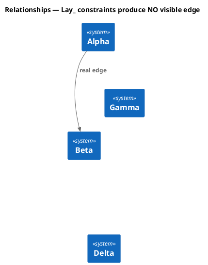 | 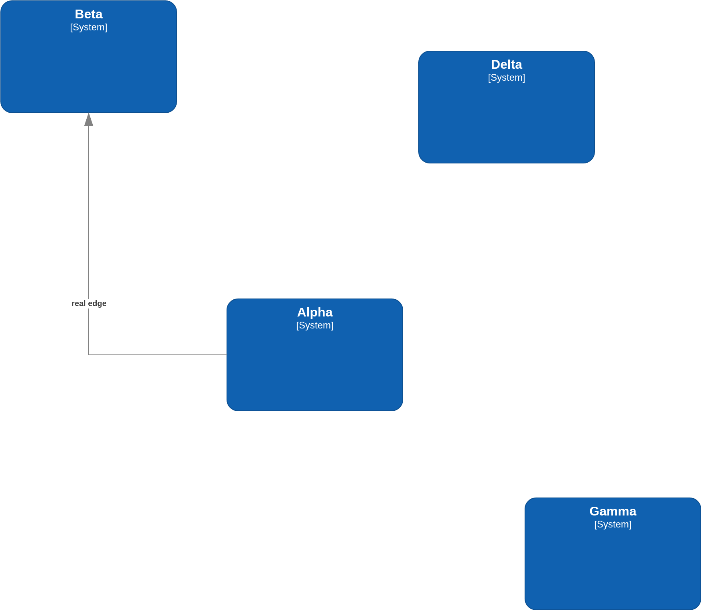 |

PlantUML source

```plantuml
@startuml rel-layout-constraints
!include https://raw.githubusercontent.com/plantuml-stdlib/C4-PlantUML/v2.10.0/C4_Container.puml
title Relationships — Lay_ constraints produce NO visible edge
System(a, "Alpha")
System(b, "Beta")
System(c, "Gamma")
System(d, "Delta")
Rel(a, b, "real edge")
Lay_D(a, c)
Lay_R(b, d)
Lay_Distance(c, d, 2)
@enduml
```

### `rel-long-labels.puml`

| Source PlantUML | catalyst → draw.io |
|---|---|
| 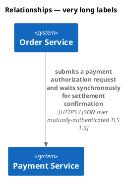 | 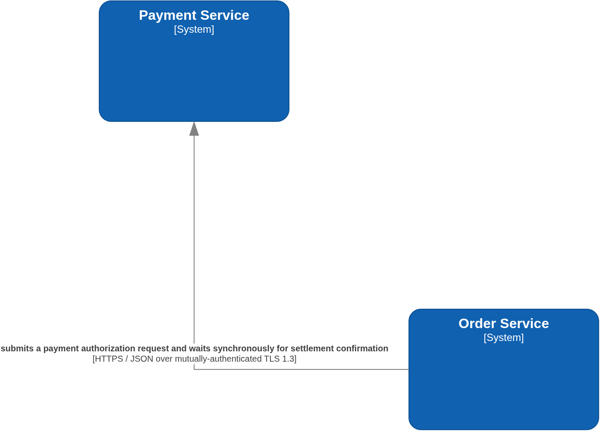 |

PlantUML source

```plantuml
@startuml rel-long-labels
!include https://raw.githubusercontent.com/plantuml-stdlib/C4-PlantUML/v2.10.0/C4_Container.puml
title Relationships — very long labels
System(a, "Order Service")
System(b, "Payment Service")
Rel(a, b, "submits a payment authorization request and waits synchronously for settlement confirmation", "HTTPS / JSON over mutually-authenticated TLS 1.3")
@enduml
```

### `rel-tech-vs-notech.puml`

| Source PlantUML | catalyst → draw.io |
|---|---|
| 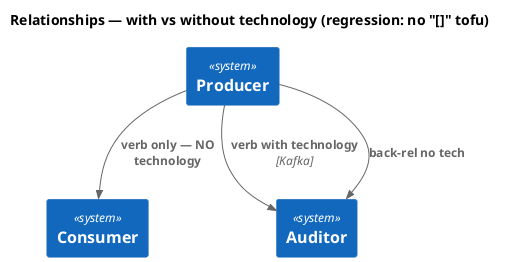 | 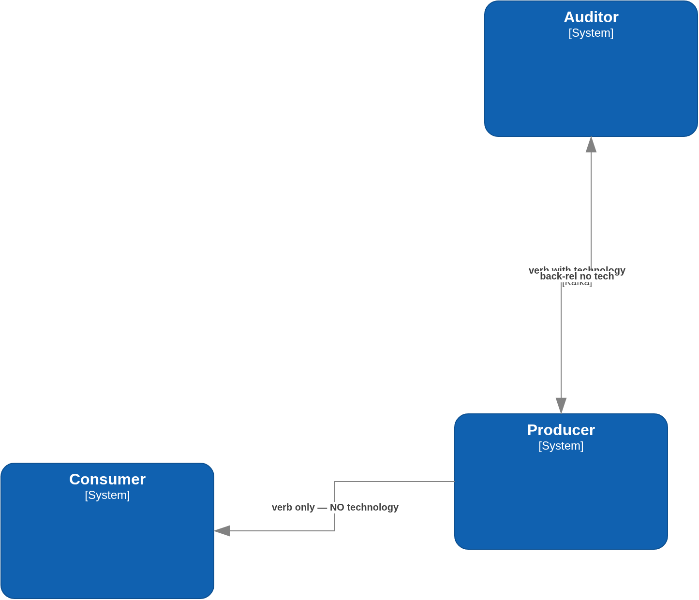 |

PlantUML source

```plantuml
@startuml rel-tech-vs-notech
!include https://raw.githubusercontent.com/plantuml-stdlib/C4-PlantUML/v2.10.0/C4_Container.puml
title Relationships — with vs without technology (regression: no "[]" tofu)
System(a, "Producer")
System(b, "Consumer")
System(c, "Auditor")
Rel(a, b, "verb only — NO technology")
Rel(a, c, "verb with technology", "Kafka")
Rel_Back(c, a, "back-rel no tech")
@enduml
```

## C4 level coverage

One canonical diagram per C4 abstraction (Component, Dynamic, System Landscape). Context/Container/Deployment live in tests/fixtures/.

### `level-component.puml`

| Source PlantUML | catalyst → draw.io |
|---|---|
| 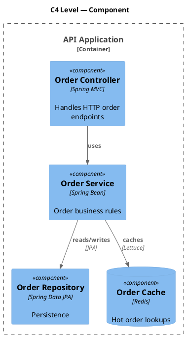 | 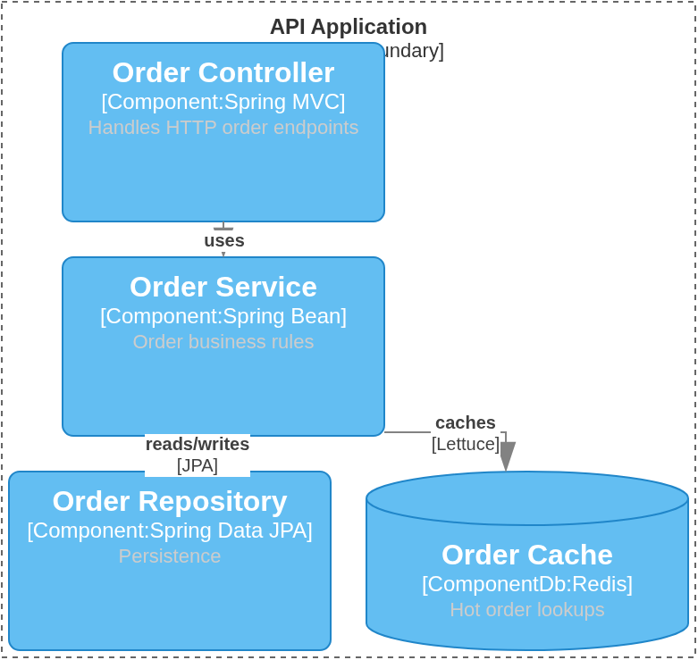 |

PlantUML source

```plantuml
@startuml level-component
!include https://raw.githubusercontent.com/plantuml-stdlib/C4-PlantUML/v2.10.0/C4_Component.puml
title C4 Level — Component
Container_Boundary(api, "API Application") {
  Component(ctrl, "Order Controller", "Spring MVC", "Handles HTTP order endpoints")
  Component(svc, "Order Service", "Spring Bean", "Order business rules")
  Component(repo, "Order Repository", "Spring Data JPA", "Persistence")
  ComponentDb(cache, "Order Cache", "Redis", "Hot order lookups")
}
Rel(ctrl, svc, "uses")
Rel(svc, repo, "reads/writes", "JPA")
Rel(svc, cache, "caches", "Lettuce")
@enduml
```

### `level-dynamic.puml`

| Source PlantUML | catalyst → draw.io |
|---|---|
| 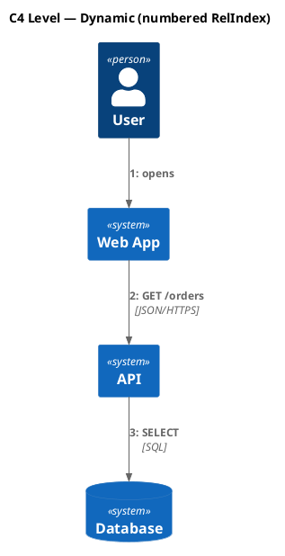 | 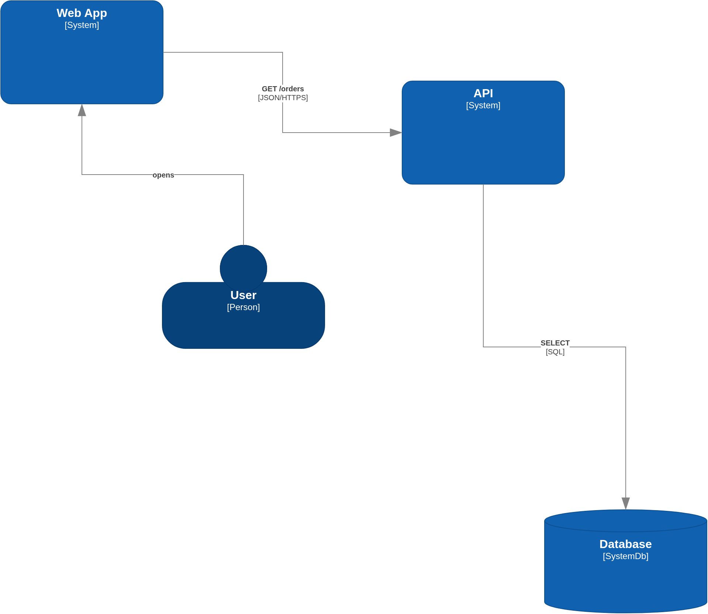 |

PlantUML source

```plantuml
@startuml level-dynamic
!include https://raw.githubusercontent.com/plantuml-stdlib/C4-PlantUML/v2.10.0/C4_Dynamic.puml
title C4 Level — Dynamic (numbered RelIndex)
Person(user, "User")
System(web, "Web App")
System(api, "API")
SystemDb(db, "Database")
RelIndex(1, user, web, "opens")
RelIndex(2, web, api, "GET /orders", "JSON/HTTPS")
RelIndex(3, api, db, "SELECT", "SQL")
@enduml
```

### `level-system-landscape.puml`

| Source PlantUML | catalyst → draw.io |
|---|---|
| 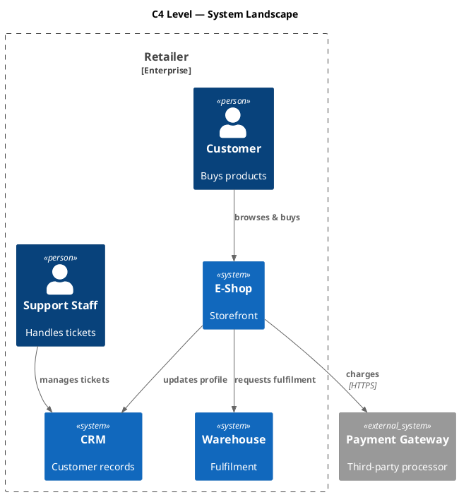 | 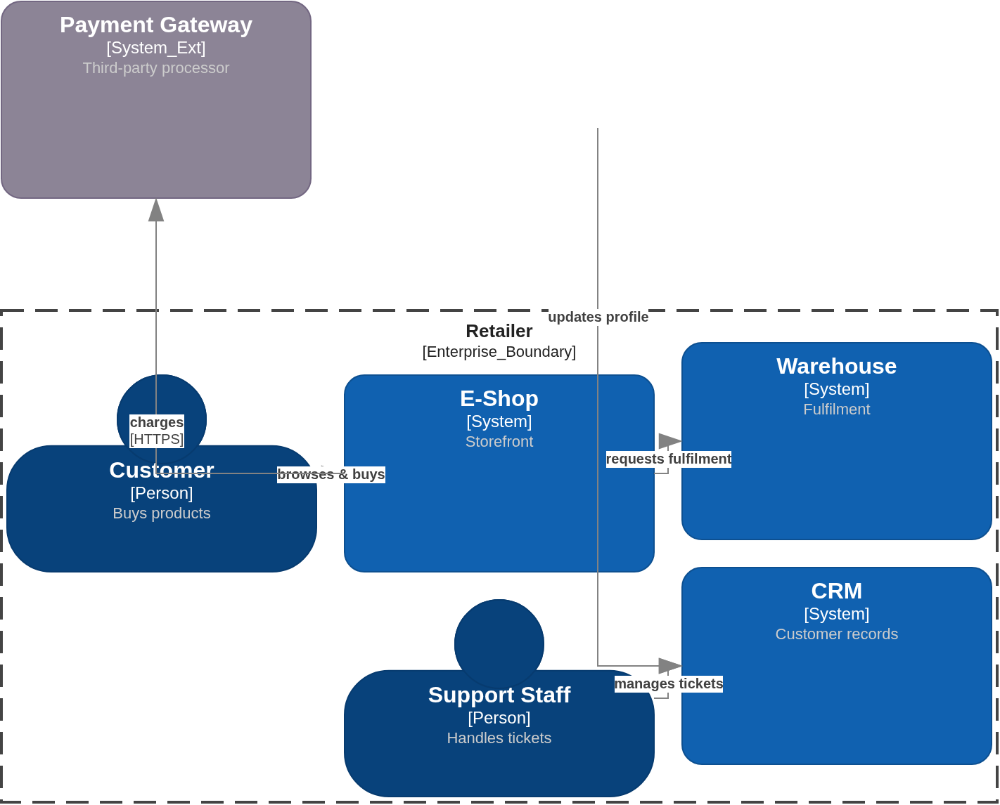 |

PlantUML source

```plantuml
@startuml level-system-landscape
!include https://raw.githubusercontent.com/plantuml-stdlib/C4-PlantUML/v2.10.0/C4_Context.puml
title C4 Level — System Landscape
Enterprise_Boundary(e, "Retailer") {
  Person(cust, "Customer", "Buys products")
  Person(staff, "Support Staff", "Handles tickets")
  System(shop, "E-Shop", "Storefront")
  System(crm, "CRM", "Customer records")
  System(wms, "Warehouse", "Fulfilment")
}
System_Ext(pay, "Payment Gateway", "Third-party processor")
Rel(cust, shop, "browses & buys")
Rel(staff, crm, "manages tickets")
Rel(shop, pay, "charges", "HTTPS")
Rel(shop, wms, "requests fulfilment")
Rel(shop, crm, "updates profile")
@enduml
```

## Edge cases & styling

Tags / dashed rels, Unicode & XML-special chars, label-only entities, a ~30-node diagram.

### `edge-empty-descriptions.puml`

| Source PlantUML | catalyst → draw.io |
|---|---|
| 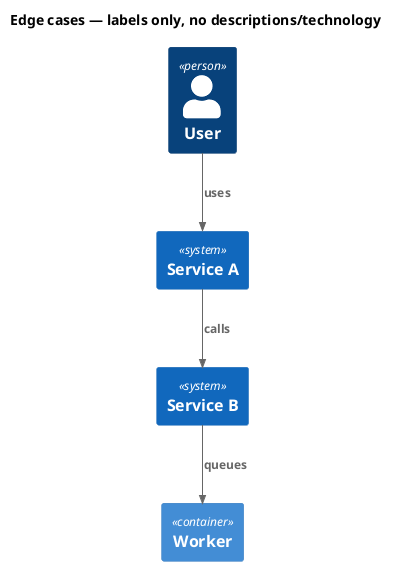 | 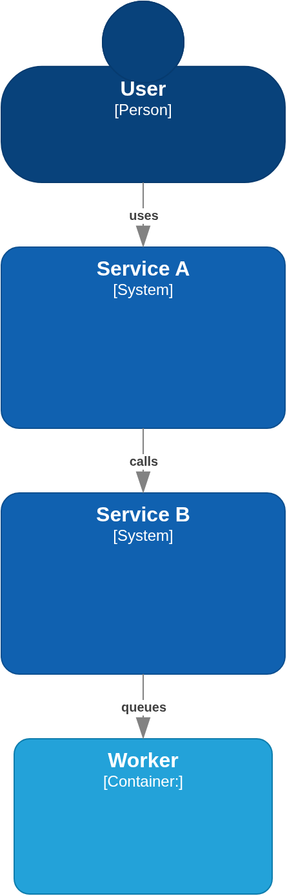 |

PlantUML source

```plantuml
@startuml edge-empty-descriptions
!include https://raw.githubusercontent.com/plantuml-stdlib/C4-PlantUML/v2.10.0/C4_Container.puml
title Edge cases — labels only, no descriptions/technology
Person(u, "User")
System(a, "Service A")
System(b, "Service B")
Container(c, "Worker")
Rel(u, a, "uses")
Rel(a, b, "calls")
Rel(b, c, "queues")
@enduml
```

### `edge-large-graph.puml`

| Source PlantUML | catalyst → draw.io |
|---|---|
| 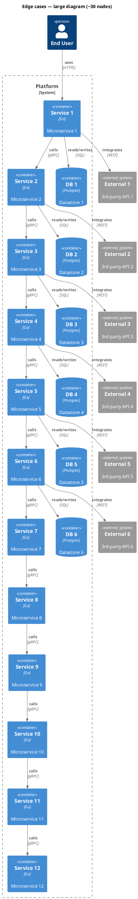 | 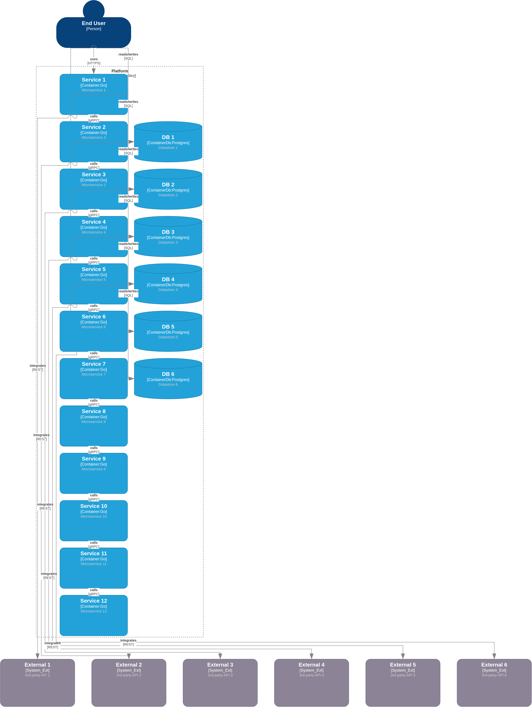 |

PlantUML source

```plantuml
@startuml edge-large-graph
!include https://raw.githubusercontent.com/plantuml-stdlib/C4-PlantUML/v2.10.0/C4_Container.puml
title Edge cases — large diagram (~30 nodes)
Person(user, "End User")
System_Boundary(sys, "Platform") {
  Container(svc1, "Service 1", "Go", "Microservice 1")
  Container(svc2, "Service 2", "Go", "Microservice 2")
  Container(svc3, "Service 3", "Go", "Microservice 3")
  Container(svc4, "Service 4", "Go", "Microservice 4")
  Container(svc5, "Service 5", "Go", "Microservice 5")
  Container(svc6, "Service 6", "Go", "Microservice 6")
  Container(svc7, "Service 7", "Go", "Microservice 7")
  Container(svc8, "Service 8", "Go", "Microservice 8")
  Container(svc9, "Service 9", "Go", "Microservice 9")
  Container(svc10, "Service 10", "Go", "Microservice 10")
  Container(svc11, "Service 11", "Go", "Microservice 11")
  Container(svc12, "Service 12", "Go", "Microservice 12")
  ContainerDb(db1, "DB 1", "Postgres", "Datastore 1")
  ContainerDb(db2, "DB 2", "Postgres", "Datastore 2")
  ContainerDb(db3, "DB 3", "Postgres", "Datastore 3")
  ContainerDb(db4, "DB 4", "Postgres", "Datastore 4")
  ContainerDb(db5, "DB 5", "Postgres", "Datastore 5")
  ContainerDb(db6, "DB 6", "Postgres", "Datastore 6")
}
System_Ext(ext1, "External 1", "3rd-party API 1")
System_Ext(ext2, "External 2", "3rd-party API 2")
System_Ext(ext3, "External 3", "3rd-party API 3")
System_Ext(ext4, "External 4", "3rd-party API 4")
System_Ext(ext5, "External 5", "3rd-party API 5")
System_Ext(ext6, "External 6", "3rd-party API 6")
Rel(user, svc1, "uses", "HTTPS")
Rel(svc1, svc2, "calls", "gRPC")
Rel(svc2, svc3, "calls", "gRPC")
Rel(svc3, svc4, "calls", "gRPC")
Rel(svc4, svc5, "calls", "gRPC")
Rel(svc5, svc6, "calls", "gRPC")
Rel(svc6, svc7, "calls", "gRPC")
Rel(svc7, svc8, "calls", "gRPC")
Rel(svc8, svc9, "calls", "gRPC")
Rel(svc9, svc10, "calls", "gRPC")
Rel(svc10, svc11, "calls", "gRPC")
Rel(svc11, svc12, "calls", "gRPC")
Rel(svc1, db1, "reads/writes", "SQL")
Rel(svc2, db2, "reads/writes", "SQL")
Rel(svc3, db3, "reads/writes", "SQL")
Rel(svc4, db4, "reads/writes", "SQL")
Rel(svc5, db5, "reads/writes", "SQL")
Rel(svc6, db6, "reads/writes", "SQL")
Rel(svc1, ext1, "integrates", "REST")
Rel(svc2, ext2, "integrates", "REST")
Rel(svc3, ext3, "integrates", "REST")
Rel(svc4, ext4, "integrates", "REST")
Rel(svc5, ext5, "integrates", "REST")
Rel(svc6, ext6, "integrates", "REST")
@enduml
```

### `edge-tags-styling.puml`

| Source PlantUML | catalyst → draw.io |
|---|---|
| 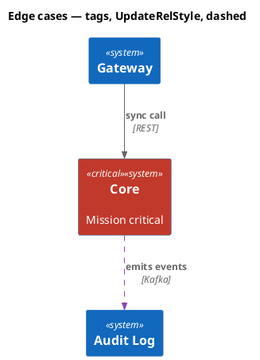 | 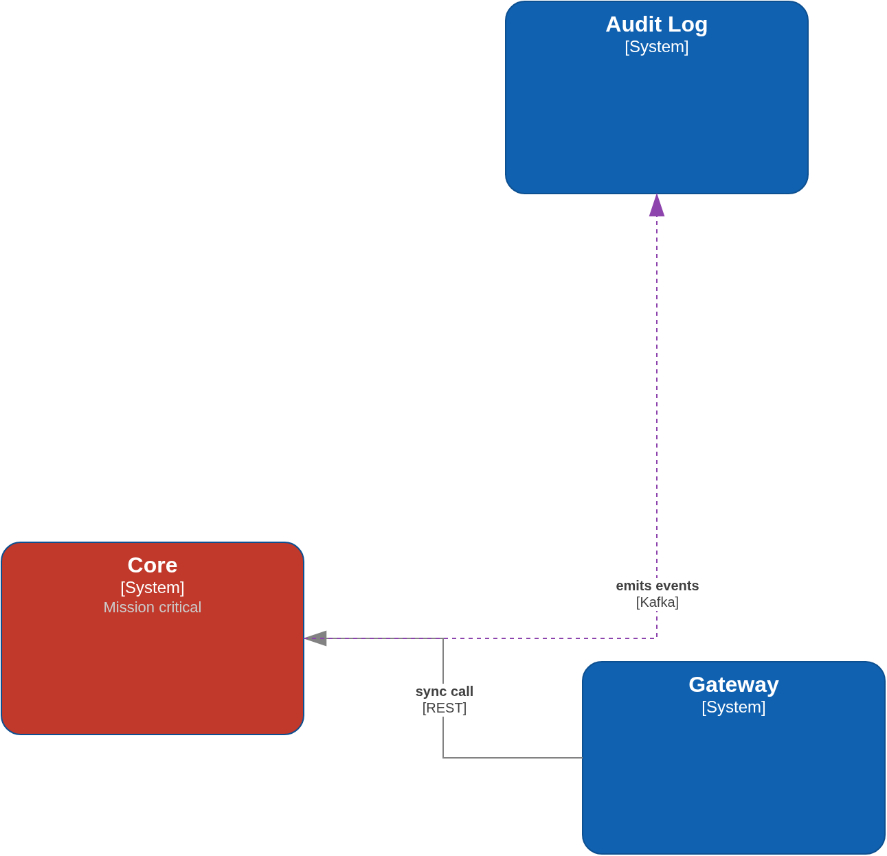 |

PlantUML source

```plantuml
@startuml edge-tags-styling
!include https://raw.githubusercontent.com/plantuml-stdlib/C4-PlantUML/v2.10.0/C4_Container.puml
title Edge cases — tags, UpdateRelStyle, dashed
AddElementTag("critical", $bgColor="#c0392b", $fontColor="#ffffff")
AddRelTag("async", $lineColor="#8e44ad", $lineStyle=DashedLine())
System(a, "Gateway")
System(b, "Core", "Mission critical", $tags="critical")
System(c, "Audit Log")
Rel(a, b, "sync call", "REST")
Rel(b, c, "emits events", "Kafka", $tags="async")
@enduml
```

### `edge-unicode-specialchars.puml`

| Source PlantUML | catalyst → draw.io |
|---|---|
| 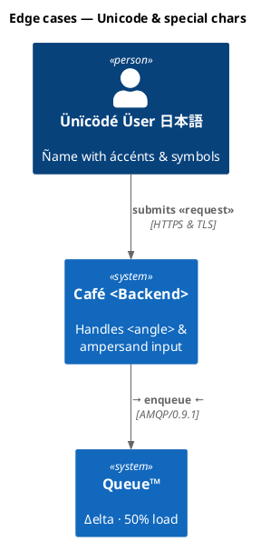 | 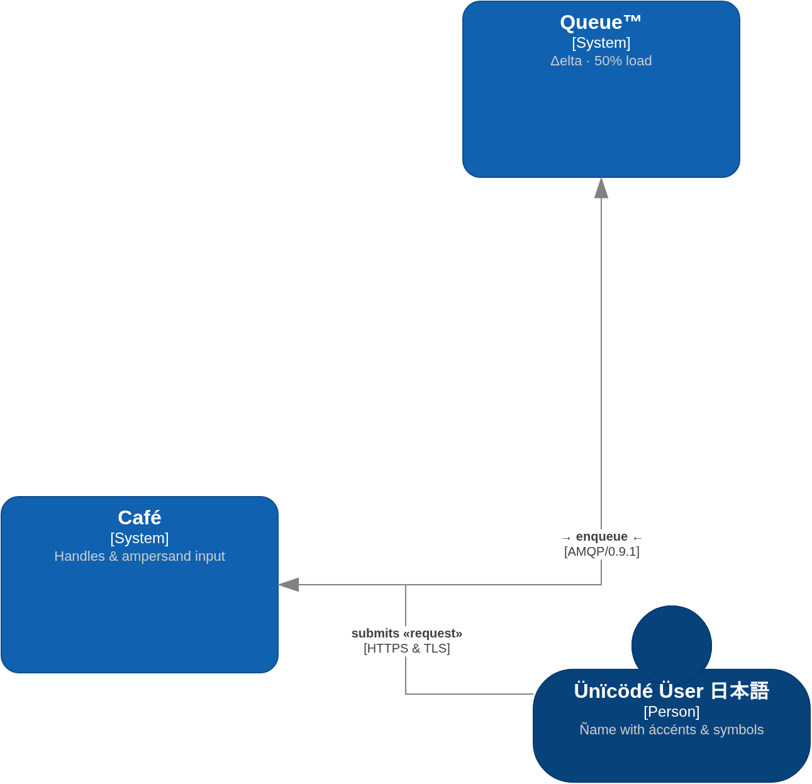 |

PlantUML source

```plantuml
@startuml edge-unicode-specialchars
!include https://raw.githubusercontent.com/plantuml-stdlib/C4-PlantUML/v2.10.0/C4_Container.puml
title Edge cases — Unicode & special chars
Person(u, "Ünïcödé Üser 日本語", "Ñame with áccénts & symbols")
System(s, "Café <Backend>", "Handles <angle> & ampersand input")
System(q, "Queue™", "Δelta · 50% load")
Rel(u, s, "submits «request»", "HTTPS & TLS")
Rel(s, q, "→ enqueue ←", "AMQP/0.9.1")
@enduml
```

