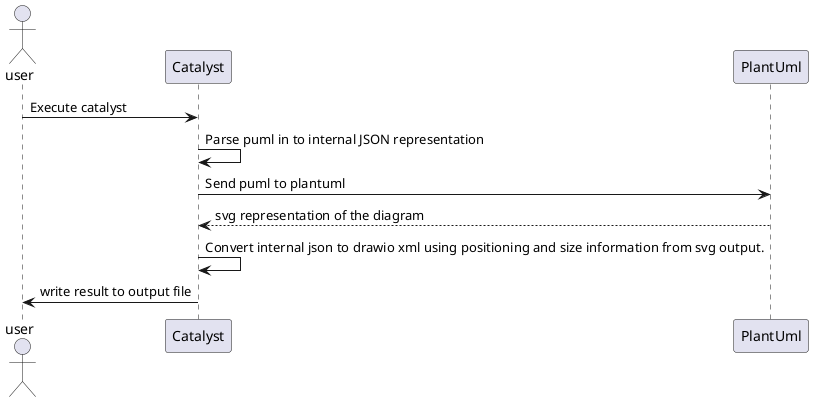

# Transformation

```plantuml {scale: 0.7}
@startuml
Actor user as USER
participant     Catalyst     as CA
participant     PlantUml     as PL
USER -> CA: Execute catalyst
CA -> CA: Parse puml in to internal JSON representation
CA -> PL: Send puml to plantuml
return svg representation of the diagram
CA -> CA: Convert internal json to drawio xml using positioning and size information from svg output. 
CA -> USER: write result to output file
@enduml

```