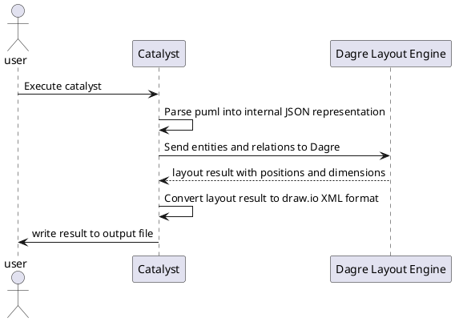

# Transformation

```plantuml {scale: 0.7}
@startuml
Actor user as USER
participant     Catalyst     as CA
participant     "Dagre Layout Engine"     as DL
USER -> CA: Execute catalyst
CA -> CA: Parse puml into internal JSON representation
CA -> DL: Send entities and relations to Dagre
return layout result with positions and dimensions
CA -> CA: Convert layout result to draw.io XML format
CA -> USER: write result to output file
@enduml

```
